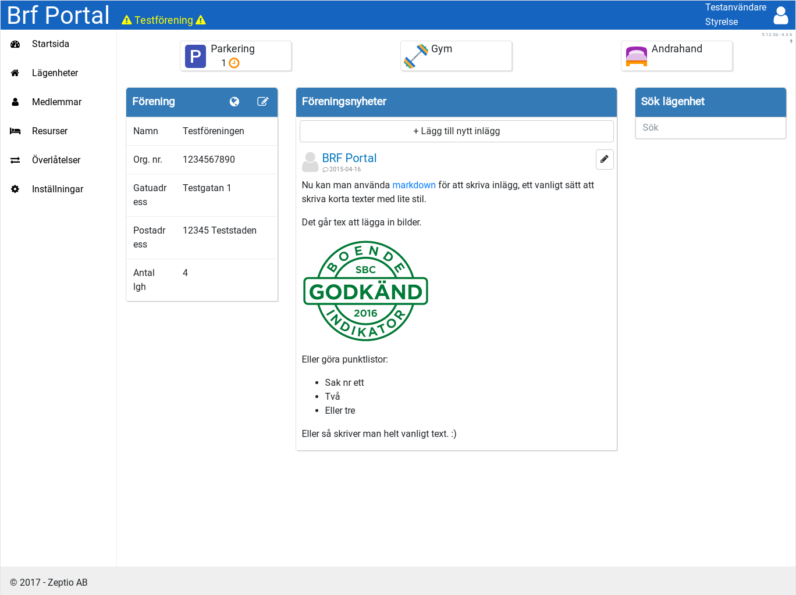
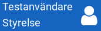
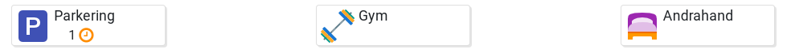
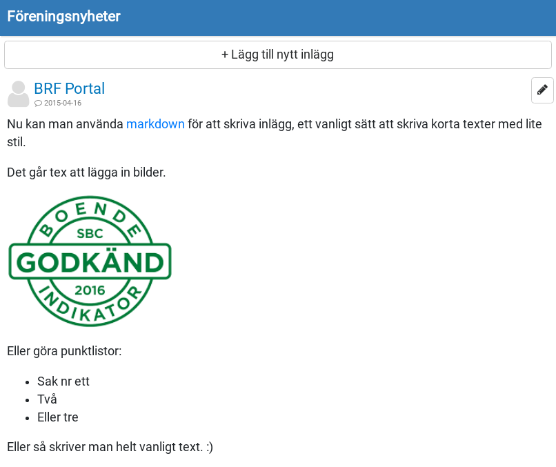
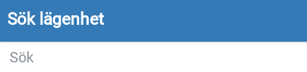
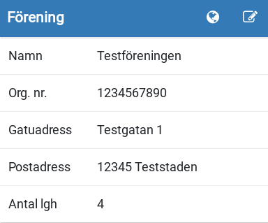
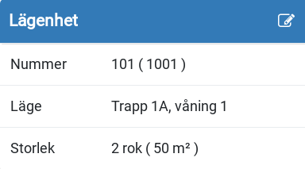
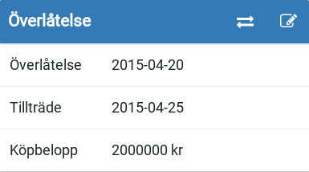
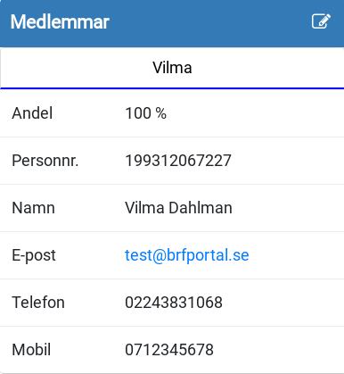

Detta är första vyn när man loggar in på BRF Portal:

Denna vy är uppdelad i olika sektioner, som behandlas under kommande rubriker.

## Användardetaljer

Visar namn och nivå på den inloggade användaren.

Klicka för att öppna en mer detaljerad vy.

[Mer info...](https://brfportal.readthedocs.io/sv/latest/user/)

## Förfrågningar

Rutorna visar status för respektive resurstyp, med antal väntande och godkända förfrågningar.

[Mer info...](https://brfportal.readthedocs.io/sv/latest/requests/)

## Föreningsnyheter

Här visat ett flöde med föreningen senast inlagda nyheter.

Styrelsemedlemmar kan lägg till nya inlägg, eller ändra de som ligger redan genom att klicka på pennan.

## Sök lägenhet

Skriv in medlemsnamn eller lägenhetsnummer (unikt) för att söka på lägenheter.

När du har valt en lägenhet att ladda visas informationen om denna nedanför.

# Informationsrutor

Om du är inloggad som styrelse kan du ändra informationen för din förening eller laddad lägenhet genom att klicka på pekikonen vid respektive ruta.

## Förening

Genom att klicka på globen kommer du till föreningens egna hemsida (om tillgänglig)

## Lägenhet

## Överlåtelse

Genom att klicka på de korsade pilarna kommer du till dialogen för att registrera en överlåtelse.

[Mer info...](https://brfportal.readthedocs.io/sv/latest/sale/)

## Ägare

