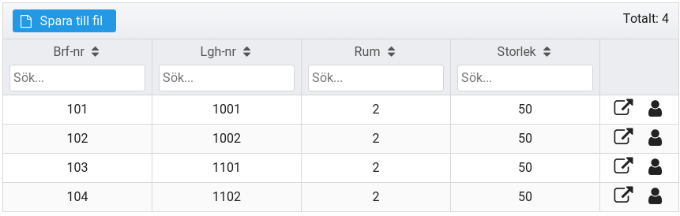
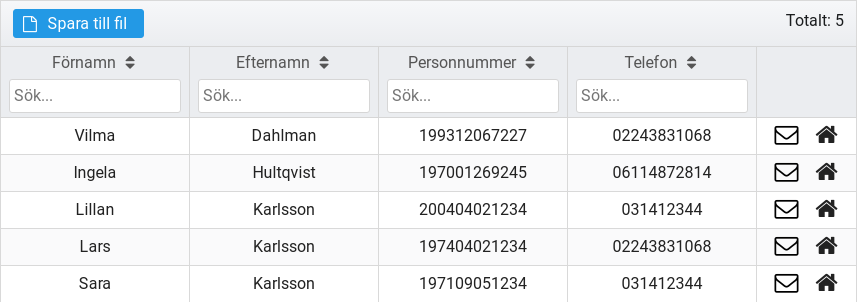
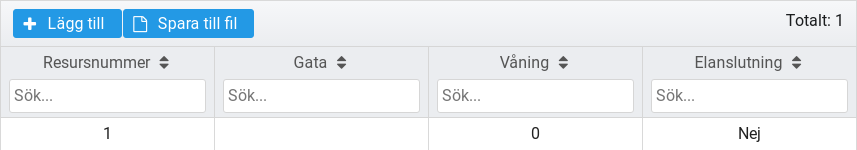
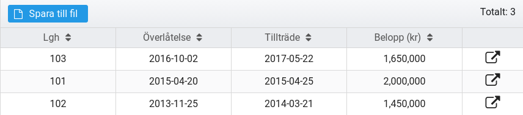

## Startsida

Går tillbaka till [Översikten](https://brfportal.readthedocs.io/sv/latest/dash/)

## Lägenheter

Klicka på en rad för att se och ändra information för den lägenheten.

Klicka på pilen för att ladda lägenheten till översiktssidan.

Klicka på gubben för att visa ägare till en lägenhet (om registrerat).

## Medlemmar

Klicka på en rad för att se och ändra information för den ägaren.

Klicka på brevet för att skicka e-post till medlemmen (om adress finns registrerad).

Klicka på huset för att se medlemmens ägandeskap i föreningen.

## Resurser

Klicka på en rad för att se och ändra information för den resursen.

## Överlåtelser

Klicka på en rad för att se och ändra information för den överlåtelsen.

Klicka på pilen för att ladda lägenheten till översiktssidan.

## Inställningar

Visar föreningsinställningar