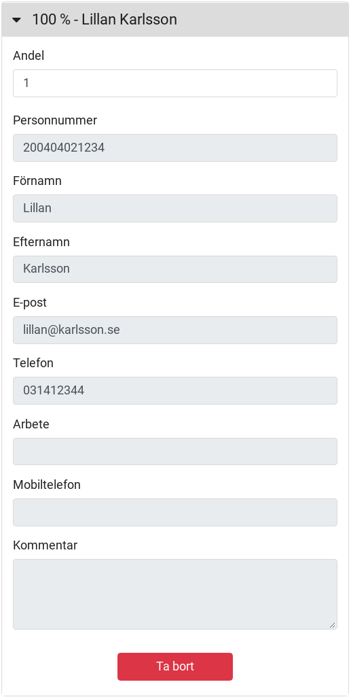
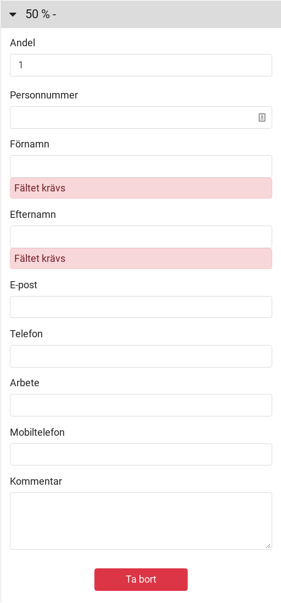
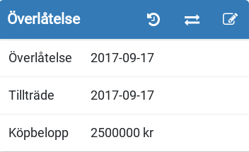
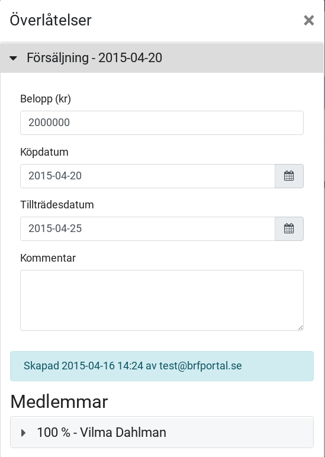

En lägenhet måste vara laddad på översikten för att du ska kunna registrera en överlåtelse. Den lägenhet som är laddad kommer användas för registreringen.

När du laddat en lägenhet på översikten kommer du se informationsrutan nedan.

Genom att klicka på de korsade pilarna kommer du till dialogen för att registrera en överlåtelse.

# Registrera ny överlåtelse

När du väljer att registrera en ny överlåtelse på en lägenhet visas en dialog med följande innehåll.

### Sammanfattning

Här ser du en lista över vad som behöver fyllas i för att en överlåtelse kan accepteras av systemet.

### Försäljning

Ska innehålla köpdatum och tillträdesdatum, och alternativt ett belopp och kommentar.

### Ägare

Ska innehålla minst en köpare, som antingen kan hämtas från föreningens register eller skapas som ny medlem.

**Andelar anges av del av total andel. Detta för att det ska bli rätt även om tex. tre ägare delar lika**

**Exempel: Om tre personer ska ha fördelningen 45% / 45% / 10% kan skriva 45/45/10 eller 9/9/2 på respektive ägare, resultatet blir detsamma.**

Om medlemmen som ska läggas in redan är medlem i förening kan du söka på dess e-post eller personnummer. Om du får en träff väljer du medlemmen i listan och får då ett förifyllt formulär.

Om du väljer att lägga in en helt ny ägare så kommer istället formulär där du får fylla i dess information.

**För att medlemmen ska kunna använda BRF Portal behöver giltig e-postadress registreras**

### Avsluta förfrågningar

När en överlåtelse skapas har du möjlighet att välja om de förfrågningar som finns registrerade på lägenhet ska avslutas eller behållas.

Vid nya köpare bör förfrågningar avslutas, för att sedan läggas in för de nya ägarna. Detta för att få bättre uppföljning på användandet och för att hindra de nya ägarna att se den förra medlemmens användande.

### Bekräfta lägenhetsnummer

För att förhindra att överlåtelsen registreras på fel lägenhet så måste du skriva in lägenhetsnumret innan den kan skickas in.

### Skicka in

När alla punkterna i sammanfattningen är markerade med en grön bock, kan du registrera överlåtelsen med knappen.

# Gamla överlåtelser

När en lägenhet har fått flera överlåtelser registrerade på sig kommer en ny knapp dyka upp på översikten, formad som en klocka med en pil bakåt i tiden.

Genom att klicka på denna knappen kommer du till en dialog där den laddade lägenhetens tidgare överlåtelser visas.

