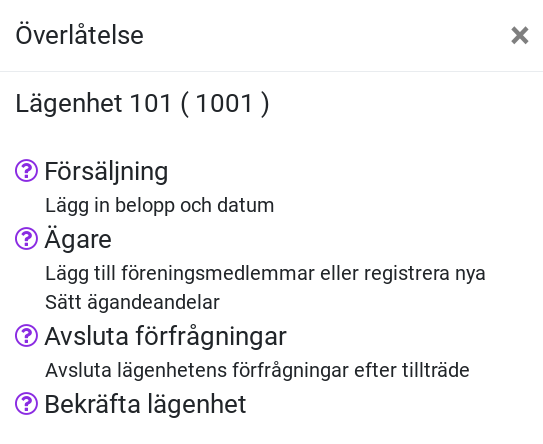
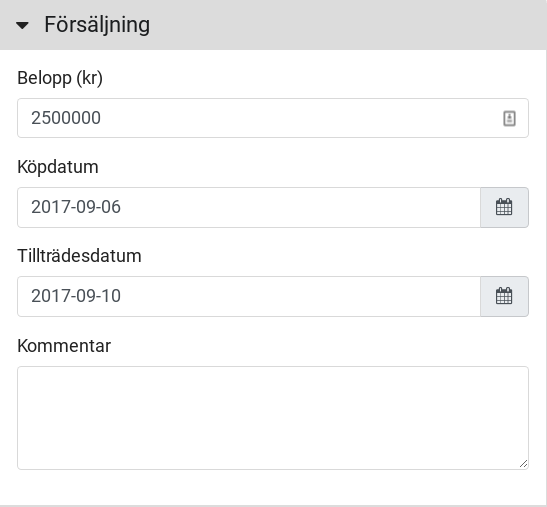
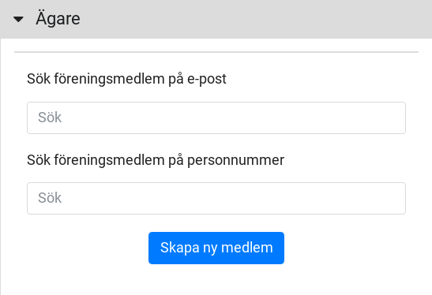
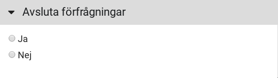
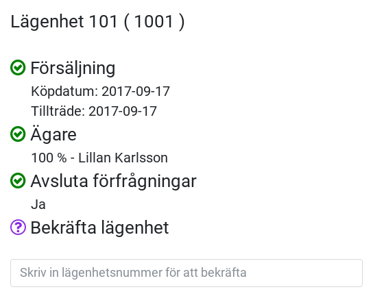
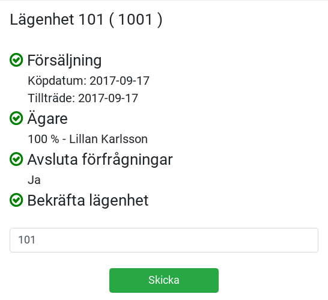

# Överlåtelser

En lägenhet måste vara laddad på översikten för att du ska kunna registrera en överlåtelse. Den lägenhet som är laddad kommer användas för registreringen.

När du laddat en lägenhet på översikten kommer du se informationsrutan nedan.

Genom att klicka på de korsade pilarna kommer du till dialogen för att registrera en överlåtelse.

## Registrera ny överlåtelse

När du väljer att registrera en ny överlåtelse på en lägenhet visas en dialog med följande innehåll.

### Sammanfattning

Här ser du en lista över vad som behöver fyllas i för att en överlåtelse kan accepteras av systemet.

### Försäljning

Ska innehålla köpdatum och tillträdesdatum, och alternativt ett belopp och kommentar.

### Ägare

Ska innehålla minst en köpare, som antingen kan hämtas från föreningens register eller skapas som ny medlem.

### Förfrågningar

När en överlåtelse skapas har du möjlighet att välja om de förfrågningar som finns registrerade på lägenhet ska avslutas eller behållas.

Vi nya köpare bör förfrågningar avslutas, för att sedan läggas in för de nya ägarna.

### Bekräfta lägenhetsnummer

För att förhindra att överlåtelsen registreras på fel lägenhet så måste du skriva in lägenhetsnumret innan den kan skickas in.

### Skicka in

När alla punkterna i sammanfattningen är markerade med en grön bock, kan du registrera överlåtelsen med knappen.

